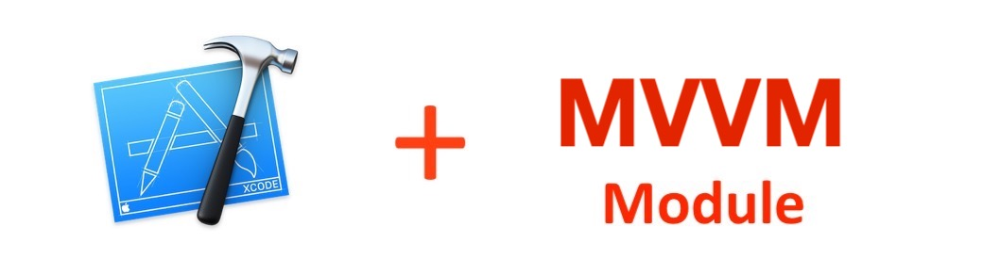

[](https://github.com/EvsenevDev/MVVMModuleTemplate/stargazers)
[](https://github.com/EvsenevDev/MVVMModuleTemplate/issues)
[](https://github.com/EvsenevDev/MVVMModuleTemplate/blob/master/LICENSE)

Once you've decided to use a MVVM architecture in your app, you should know about the routine. For each screen/module you should create at least 4 files. Imagine that you need to create 10-15 modules. To avoid this boring work you can use this template which helps you to generate a compete module. It's very useful for me, and I hope it can be useful for you too. 

## Generated files
The template generates all the files that you need to create a new MVVM module. All generated code is Swift 4 compatible.

| File Name | Acts As | Description |
| :---         |     :---      |          :--- |
| `ModuleNameViewController.swift`    | View       | UIViewController of your module which subscribe on ViewModel changes.  |
| `ModuleNameViewModel.swift`    | ViewModel  | It's shoud updates by API/DB responses with Models.      |
| `ModuleNameRouter.swift`    | Router     | It's for routing to other modules.    |
| `ModuleNameAssembly.swift`    |   Assembly   | It's an assembly, to build a module.    |

## How to install

#### Using script (easy)
Execute this command in the terminal:
```swift
swift install.swift
```

You should see this output message:

`✅ MVVM Template successfully installed.`

If it's ok, you could see your template in the Xcode.

### Manual installation
Open `~/Library/Developer/Xcode/Templates/Architecture` and add "MVVM Module.xctemplate" file. Now you can see your template in the Xcode.


## Easy to use


## MVVM Diagram overview


## MVVM Checklist
To get started easier, we’ve prepared a checklist to make sure that everything follows the MVVM’s design principle. We hope, this list will be useful for you as it is for us.

* [ ] Views and view controllers receive user interactions and pass them to ViewModel for decision making.
* [ ] ViewModels reacts on requests to change.
* [ ] ViewModels notifies about changes.
* [ ] ViewModel should not know about the existence of View.
* [ ] View subscribes on ViewModel changes.


## What is MVVM?
MVVM is not a framework, but an approach to iOS application architecture, which stands for:

#### VIEW
>View controller. It is responsible to receive user interactions and pass them to ViewModel for decision making. To keep the view simple, it shouldn’t contain any view's logic. This should be binded with ViewModel and it's changes.

#### VIEW MODEL
>The VIEW MODEL defines the models and items to show on View layer. It is responsible to emit data for the view to display. Whenever data is required, the ViewModel requests data from services.

#### MODEL
>Model is entity or set of entities which can be used for show on View layer. Models returns in Service, API or DB responses.

#### ROUTER
>Router defines the routes from one screen to another. In MVVM, the responsibility for Routing .
When the ViewModel receives user interactions and decided to navigate to another screen, it will use the Assembly to build new module and present it.

#### ASSEMBLY
>Assembly builds the modules with input params and links all layers. Should connect View with ViewModel, ViewModel and Router. Should setup input data of module and can return module Input if needed.

## Why MVVM?
After using MVVM, I've found it to be very beneficial in many ways. Let’s get back to the list of things we set out to accomplish when architecting our app to see if MVVM addresses them.

- Single responsibility principles applied.
- Data-binding
- Collaboration friendly.
- Separated out concerns.
- Spec-ability.
- Testability. 
- Easy to read and support code.

## Next steps

Would you like to decide what the next feature will be?
* [ ] Storyboard support
* [ ] Separated iPhone & iPad UIs

## References
- [iOS Architecture Patterns](https://medium.com/ios-os-x-development/ios-architecture-patterns-ecba4c38de52#.ba7q8dcih)
- [Design Patterns by Tutorials: MVVM](https://www.raywenderlich.com/34-design-patterns-by-tutorials-mvvm)
- [Introduction to MVVM: Refactoring a MVC App Using the MVVM Design Pattern](https://www.appcoda.com/mvvm-vs-mvc/)
- [Wikipedia](https://en.wikipedia.org/wiki/Model%E2%80%93view%E2%80%93viewmodel)

## Contribute
This is an open source project, so feel free to contribute.
- Open an [issue](https://github.com/EvsenevDev/MVVMModuleTemplate/issues/new).

----


## Authors

* [Bogdan Evsenev](https://twitter.com/BED_Code)
